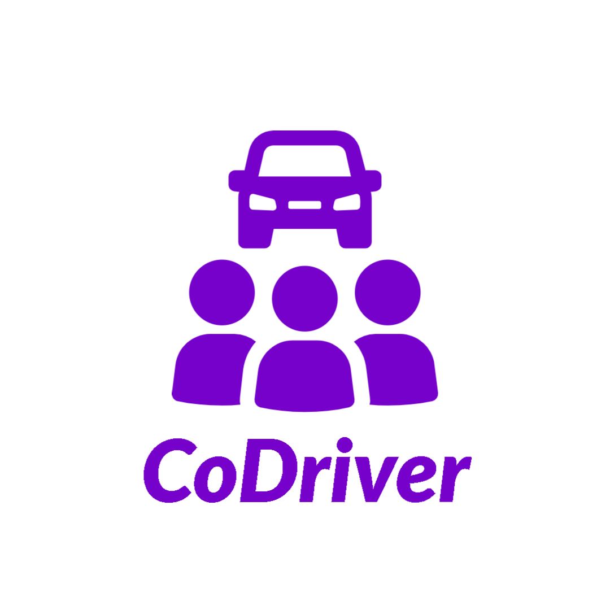
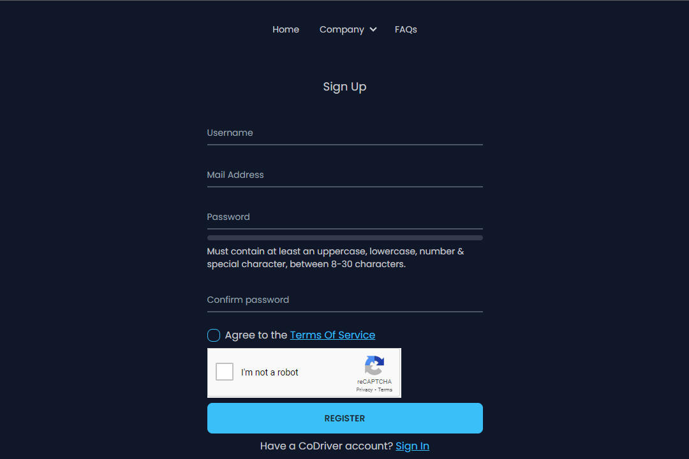

<br/>
<p align="center">
  <a href="https://github.com/Raven-Code/CoDriver">
    
  </a>

  <h3 align="center">CoDriver: Your Travel Companion for Shared Journeys</h3>

  <p align="center">
    
    <br />
    <a href="https://github.com/Raven-Code/CoDriver"><b>Explore the docs »</b></a>
    <br/>
    <br/>
    <a href="https://github.com/Raven-Code/CoDriver">View Demo</a>
    &nbsp;
    <a href="https://github.com/Raven-Code/CoDriver/issues">Report Bug</a>
    &nbsp;
    <a href="https://github.com/Raven-Code/CoDriver/issues">Request Feature</a>
  </p>
</p>

<!--       -->

## Table Of Contents

-   [About the Project](#about-the-project)
-   [Built With](#built-with)
-   [Getting Started](#getting-started)
    -   [Prerequisites](#prerequisites)
    -   [Installation](#installation)
-   [Usage](#usage)
    1. [Creating an Account](#creating-an-account)
    2. [Exploring Rides](#exploring-rides)
    3. [Joining and Creating Groups](#joining-and-creating-groups)
    4. [Direct Messaging](#direct-messaging)
    5. [Scheduling Recurring Rides](#scheduling-recurring-rides)
    6. [Making Payments](#making-payments)
    7. [Rating and Feedback](#rating-and-feedback)
    8. [Safety and Security](#safety-and-security)
    9. [Support and Assistance](#support-and-assistance)
-   [Contributing](#contributing)
-   [License](#license)
-   [Authors](#authors)

## About The Project



# Introducing CoDriver: Revolutionizing Your Commutes and Journeys

## Problem Solved:

Coordinating rides and sharing journeys shouldn't be a hassle anymore. CoDriver addresses the challenges faced by drivers and passengers who seek a seamless carpooling experience for daily commutes or long-distance travel.

## For Whom:

CoDriver is designed for individuals looking to carpool for their daily commutes or embark on long-distance journeys. We understand the need for reliable, cost-effective, and convenient travel solutions.

## Streamlined Experience:

CoDriver brings simplicity to ride sharing. Our platform boasts a user-friendly interface that enables you to create or join carpooling groups with ease. No more hunting for passengers or drivers – just smooth and hassle-free connections.

## Key Features:

-   **Direct Messaging:** Our messaging system ensures direct communication between drivers and passengers. Coordinate pickup and drop-off locations, discuss preferences, and ask questions all within the platform.

-   **Integrated Payments:** Seamlessly handle payments for gas and tolls through our integrated payment system. Fare calculation made easy, ensuring a fair deal for everyone.

-   **Smart Grouping:** Our platform allows you to create or join carpooling groups based on your location and destination. Connect with like-minded travelers for a shared journey.

-   **Tailored Searches:** Find rides that match your preferred route and schedule effortlessly. Filter results by criteria such as price, departure time, and available seats.

-   **Trust and Accountability:** Rate and provide feedback on your carpooling experiences. Build a community of trust and ensure accountability.

-   **Recurring Rides:** Simplify your daily commutes with the option to schedule recurring rides. Reduce the need for constant coordination and enjoy consistent rides.

-   **Safety First:** We verify user identities and driver's licenses to ensure the safety and security of all users.

-   **Efficient Navigation:** Our navigation system offers real-time traffic updates and suggests the most optimal routes for drivers, making your journey as smooth as possible.

-   **Support System:** In case of issues or disputes, our support system is here to assist you, ensuring a hassle-free experience.

Say goodbye to the complexities of ride coordination and join the CoDriver community. Experience a new era of carpooling that's easy, efficient, and enjoyable. Join us on CoDriver today and embark on a journey of shared connections and seamless travels.

## Built With

-   **Frontend Enchantment:**

    -   **Next.js:** Enabling the enchantment of server-side rendering and a seamless developer voyage.
    -   **DaisyUI and Tailwind CSS:** Conjuring mesmerizing and responsive UI elements effortlessly.
    -   **Material-UI (MUI):** Elevating the user interface with refined components embracing the finesse of Material Design.
    -   **React Google ReCaptcha:** Erecting an impregnable fortress against undesired intrusions and entrusting interactions to the right hands.
    -   **Formik and Yup:** Streamlining the intricate art of form management and validation, gifting users an intuitive experience.
    -   **NextAuth.js:** Casting an intricate web of authentication safeguards for users, shielding their journeys.
    -   **JWT:** Unleashing the prowess of secure token-based validation and entitlement.
    -   **React Confetti:** Sprinkling celebratory joy onto user engagements, adding a dash of exuberance.

-   **Backend Magic:**
    -   **Next.js API Routes:** Forging potent gateways to data, stitching them within the tapestry of the Next.js realm.
    -   **MySQL:** Orchestrating data choreography with finesse in a realm ruled by the security of relational databases.
    -   **Node.js with TypeScript:** Harmonizing the symphony of TypeScript's safety and code elegance, under the orchestration of Node.js.
    -   **bcrypt:** Forging an impenetrable fortress for user passwords, shrouding them in unbreakable armor.
    -   **Axios:** Weaving a seamless tapestry of API communication, traversing digital realms with elegance.
    -   **Stripe:** Integrating a secure and elegant conduit for monetary exchanges, enhancing the safety of the journey.
    -   **NextAuth.js:** Bestowing a shield of trust, rendering the sanctum of authentication even more impervious.

The synthesis of these avant-garde marvels begets a realm where performance, security, and user delight dance in harmonious unison. Each choice, a carefully curated masterpiece, is woven together to conjure a platform that not only captivates the visual senses but also safeguards, streamlines, and elevates user explorations to new heights.

## Getting Started

Welcome to CoDriver! This guide will help you get started with setting up and running the CoDriver project on your local machine using the `npm run dev` command.

### Prerequisites

Before you begin, make sure you have the following software installed on your system:

-   [Node.js](https://nodejs.org/)

### Installation

1. Clone the CoDriver repository to your local machine using Git:

```sh
git clone https://github.com/Raven-Code/CoDriver.git
```

2. Navigate to the directory

```sh
cd CoDriver
```

3. Install the project dependencies using npm:

```sh
npm install
```

4. Open the project's .env file, and provide the necessary configuration details. You will need to provide:

    - Discord Webhook URL
    - Google reCAPTCHA Key
    - Cat API Key
    - Google Maps API Key
    - Stripe API Key
    - MYSQL Database information (Host, Name, Username, Password)

5. Once you have the project set up and configured, you can start the development server using the following command:

```sh
npm run dev
```

5. Once you have started the project server, go to http://localhost:4000 to check out the project's website

## Usage

### Creating an Account

To get started, create an account on the CoDriver platform using your email address. You'll need to provide some basic information and set up a password. Once your account is created, you can log in and start exploring.

### Exploring Rides

After logging in, you can search for available rides based on your preferred route, schedule, and other criteria. CoDriver's user-friendly interface makes it easy to find rides that match your travel requirements.

### Joining and Creating Groups

Found a ride that suits you? Join the ride group to coordinate with the driver and fellow passengers. If you're driving, create a group and invite others to join. CoDriver's smart grouping ensures a hassle-free connection.

### Direct Messaging

Need to coordinate pickup or discuss preferences? Use CoDriver's direct messaging system to communicate with the driver and passengers within the platform. Coordinate seamlessly and ensure a smooth journey.

### Scheduling Recurring Rides

For daily or weekly commutes, use CoDriver's recurring rides feature. Set up your preferred schedule, and CoDriver will take care of the rest. No more constant coordination – enjoy consistent rides with ease.

### Making Payments

Handling payments for gas and tolls is a breeze with CoDriver's integrated payment system. Fare calculation is made simple, ensuring a fair deal for everyone. Say goodbye to awkward payment discussions.

### Rating and Feedback

After your ride, use CoDriver's rating system to provide feedback on your carpooling experience. Build trust and accountability within the community by sharing your thoughts and helping others make informed choices.

### Safety and Security

CoDriver prioritizes your safety. Our verification system ensures the authenticity of user identities and driver's licenses, creating a secure environment for all users. Travel with peace of mind.

### Support and Assistance

Encountered an issue? Need assistance? CoDriver's support system is here to help. Reach out for any queries, concerns, or disputes you may have. Our dedicated support team ensures a hassle-free experience.

With CoDriver, carpooling becomes a seamless and enjoyable journey. Say goodbye to the complexities of ride coordination and embrace a new era of shared travel. Join the CoDriver community today and experience convenience, reliability, and connection like never before.

## Contributing

Contributions are what make the open source community such an amazing place to be learn, inspire, and create. Any contributions you make are **greatly appreciated**.

-   If you have suggestions for adding or removing projects, feel free to [open an issue](https://github.com/Raven-Code/CoDriver/issues/new) to discuss it, or directly create a pull request after you edit the _README.md_ file with necessary changes.
-   Please make sure you check your spelling and grammar.
-   Create individual PR for each suggestion.

## License

_Version 2.0, January 2004_  
_&lt;<http://www.apache.org/licenses/>&gt;_

### Terms and Conditions for use, reproduction, and distribution

#### 1. Definitions

“License” shall mean the terms and conditions for use, reproduction, and
distribution as defined by Sections 1 through 9 of this document.

“Licensor” shall mean the copyright owner or entity authorized by the copyright
owner that is granting the License.

“Legal Entity” shall mean the union of the acting entity and all other entities
that control, are controlled by, or are under common control with that entity.
For the purposes of this definition, “control” means **(i)** the power, direct or
indirect, to cause the direction or management of such entity, whether by
contract or otherwise, or **(ii)** ownership of fifty percent (50%) or more of the
outstanding shares, or **(iii)** beneficial ownership of such entity.

“You” (or “Your”) shall mean an individual or Legal Entity exercising
permissions granted by this License.

“Source” form shall mean the preferred form for making modifications, including
but not limited to software source code, documentation source, and configuration
files.

“Object” form shall mean any form resulting from mechanical transformation or
translation of a Source form, including but not limited to compiled object code,
generated documentation, and conversions to other media types.

“Work” shall mean the work of authorship, whether in Source or Object form, made
available under the License, as indicated by a copyright notice that is included
in or attached to the work (an example is provided in the Appendix below).

“Derivative Works” shall mean any work, whether in Source or Object form, that
is based on (or derived from) the Work and for which the editorial revisions,
annotations, elaborations, or other modifications represent, as a whole, an
original work of authorship. For the purposes of this License, Derivative Works
shall not include works that remain separable from, or merely link (or bind by
name) to the interfaces of, the Work and Derivative Works thereof.

“Contribution” shall mean any work of authorship, including the original version
of the Work and any modifications or additions to that Work or Derivative Works
thereof, that is intentionally submitted to Licensor for inclusion in the Work
by the copyright owner or by an individual or Legal Entity authorized to submit
on behalf of the copyright owner. For the purposes of this definition,
“submitted” means any form of electronic, verbal, or written communication sent
to the Licensor or its representatives, including but not limited to
communication on electronic mailing lists, source code control systems, and
issue tracking systems that are managed by, or on behalf of, the Licensor for
the purpose of discussing and improving the Work, but excluding communication
that is conspicuously marked or otherwise designated in writing by the copyright
owner as “Not a Contribution.”

“Contributor” shall mean Licensor and any individual or Legal Entity on behalf
of whom a Contribution has been received by Licensor and subsequently
incorporated within the Work.

#### 2. Grant of Copyright License

Subject to the terms and conditions of this License, each Contributor hereby
grants to You a perpetual, worldwide, non-exclusive, no-charge, royalty-free,
irrevocable copyright license to reproduce, prepare Derivative Works of,
publicly display, publicly perform, sublicense, and distribute the Work and such
Derivative Works in Source or Object form.

#### 3. Grant of Patent License

Subject to the terms and conditions of this License, each Contributor hereby
grants to You a perpetual, worldwide, non-exclusive, no-charge, royalty-free,
irrevocable (except as stated in this section) patent license to make, have
made, use, offer to sell, sell, import, and otherwise transfer the Work, where
such license applies only to those patent claims licensable by such Contributor
that are necessarily infringed by their Contribution(s) alone or by combination
of their Contribution(s) with the Work to which such Contribution(s) was
submitted. If You institute patent litigation against any entity (including a
cross-claim or counterclaim in a lawsuit) alleging that the Work or a
Contribution incorporated within the Work constitutes direct or contributory
patent infringement, then any patent licenses granted to You under this License
for that Work shall terminate as of the date such litigation is filed.

#### 4. Redistribution

You may reproduce and distribute copies of the Work or Derivative Works thereof
in any medium, with or without modifications, and in Source or Object form,
provided that You meet the following conditions:

-   **(a)** You must give any other recipients of the Work or Derivative Works a copy of
    this License; and
-   **(b)** You must cause any modified files to carry prominent notices stating that You
    changed the files; and
-   **(c)** You must retain, in the Source form of any Derivative Works that You distribute,
    all copyright, patent, trademark, and attribution notices from the Source form
    of the Work, excluding those notices that do not pertain to any part of the
    Derivative Works; and
-   **(d)** If the Work includes a “NOTICE” text file as part of its distribution, then any
    Derivative Works that You distribute must include a readable copy of the
    attribution notices contained within such NOTICE file, excluding those notices
    that do not pertain to any part of the Derivative Works, in at least one of the
    following places: within a NOTICE text file distributed as part of the
    Derivative Works; within the Source form or documentation, if provided along
    with the Derivative Works; or, within a display generated by the Derivative
    Works, if and wherever such third-party notices normally appear. The contents of
    the NOTICE file are for informational purposes only and do not modify the
    License. You may add Your own attribution notices within Derivative Works that
    You distribute, alongside or as an addendum to the NOTICE text from the Work,
    provided that such additional attribution notices cannot be construed as
    modifying the License.

You may add Your own copyright statement to Your modifications and may provide
additional or different license terms and conditions for use, reproduction, or
distribution of Your modifications, or for any such Derivative Works as a whole,
provided Your use, reproduction, and distribution of the Work otherwise complies
with the conditions stated in this License.

#### 5. Submission of Contributions

Unless You explicitly state otherwise, any Contribution intentionally submitted
for inclusion in the Work by You to the Licensor shall be under the terms and
conditions of this License, without any additional terms or conditions.
Notwithstanding the above, nothing herein shall supersede or modify the terms of
any separate license agreement you may have executed with Licensor regarding
such Contributions.

#### 6. Trademarks

This License does not grant permission to use the trade names, trademarks,
service marks, or product names of the Licensor, except as required for
reasonable and customary use in describing the origin of the Work and
reproducing the content of the NOTICE file.

#### 7. Disclaimer of Warranty

Unless required by applicable law or agreed to in writing, Licensor provides the
Work (and each Contributor provides its Contributions) on an “AS IS” BASIS,
WITHOUT WARRANTIES OR CONDITIONS OF ANY KIND, either express or implied,
including, without limitation, any warranties or conditions of TITLE,
NON-INFRINGEMENT, MERCHANTABILITY, or FITNESS FOR A PARTICULAR PURPOSE. You are
solely responsible for determining the appropriateness of using or
redistributing the Work and assume any risks associated with Your exercise of
permissions under this License.

#### 8. Limitation of Liability

In no event and under no legal theory, whether in tort (including negligence),
contract, or otherwise, unless required by applicable law (such as deliberate
and grossly negligent acts) or agreed to in writing, shall any Contributor be
liable to You for damages, including any direct, indirect, special, incidental,
or consequential damages of any character arising as a result of this License or
out of the use or inability to use the Work (including but not limited to
damages for loss of goodwill, work stoppage, computer failure or malfunction, or
any and all other commercial damages or losses), even if such Contributor has
been advised of the possibility of such damages.

#### 9. Accepting Warranty or Additional Liability

While redistributing the Work or Derivative Works thereof, You may choose to
offer, and charge a fee for, acceptance of support, warranty, indemnity, or
other liability obligations and/or rights consistent with this License. However,
in accepting such obligations, You may act only on Your own behalf and on Your
sole responsibility, not on behalf of any other Contributor, and only if You
agree to indemnify, defend, and hold each Contributor harmless for any liability
incurred by, or claims asserted against, such Contributor by reason of your
accepting any such warranty or additional liability.

Copyright 2023 CoDriver

Licensed under the Apache License, Version 2.0 (the "License");
you may not use this file except in compliance with the License.
You may obtain a copy of the License at

http://www.apache.org/licenses/LICENSE-2.0

Unless required by applicable law or agreed to in writing, software
distributed under the License is distributed on an "AS IS" BASIS,
WITHOUT WARRANTIES OR CONDITIONS OF ANY KIND, either express or implied.
See the License for the specific language governing permissions and
limitations under the License.

## Authors

-   [**Raven-Code**](https://github.com/Raven-Code)
